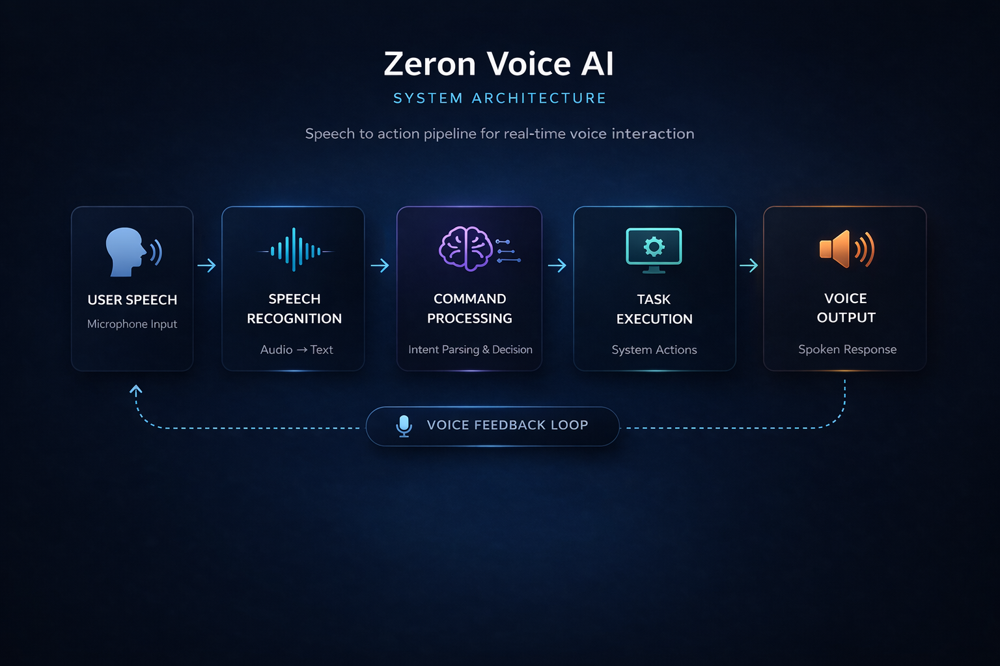

# Zeron Voice AI

A real-time voice-driven system that converts human speech into executable actions using Python.

Zeron listens, processes intent, and performs tasks across the system and web - acting as a minimal voice interface between user and machine.

---

## Overview

Zeron Voice AI is a lightweight command-driven system built around speech recognition and rule-based execution.  
It demonstrates how voice interfaces can control applications, retrieve information, and automate workflows.

---

## Core Flow

Speech → Processing → Execution → Response

---

## System Architecture



---

## Capabilities

- Real-time speech recognition  
- Voice-based command execution  
- Text-to-speech response system  
- Web interaction (Google, YouTube, Wikipedia)  
- System control (Calculator, Notepad, Terminal)  
- Media handling (music playback)  
- Basic conversational responses  

---

## Concepts Covered

Speech recognition, text-to-speech (TTS), conditional logic (`if`, `elif`), loops (`while`), command parsing, system automation and rule-based execution.

---

## Run

```bash
python main.py
